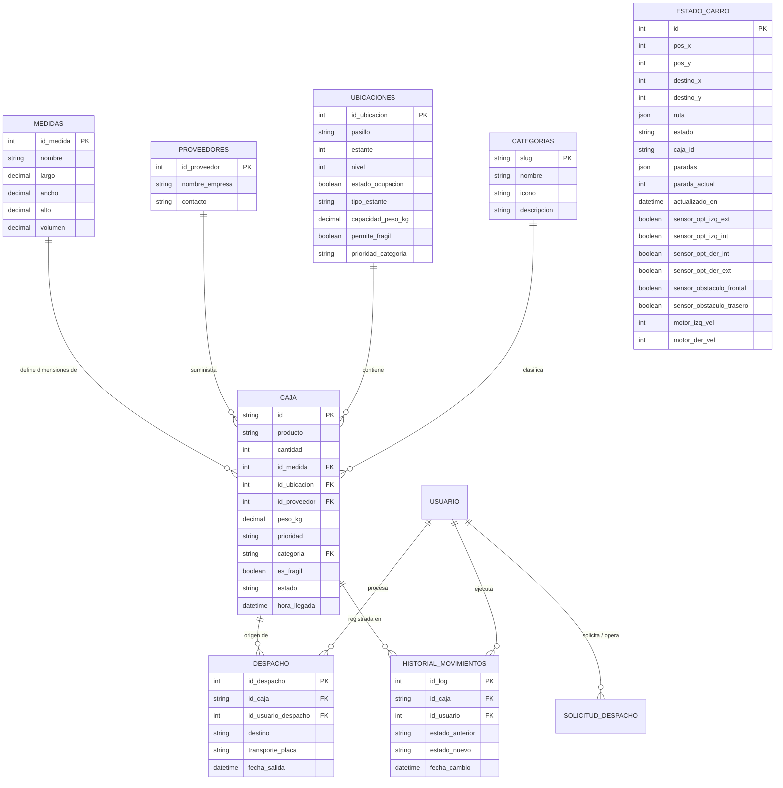

# Documentación Técnica del Proyecto LogiSmart

LogiSmart es un sistema inteligente de clasificación, almacenamiento y despacho de inventario automatizado mediante un robot AGV (Automated Guided Vehicle) controlado por un microcontrolador ESP32. La plataforma integra una interfaz web responsiva en tiempo real (Django Channels, WebSockets), comunicación industrial ligera (MQTT) y algoritmos de optimización espacial.

---

## 1. Arquitectura del Sistema

El sistema está diseñado en una topología híbrida que acopla servicios web asíncronos en la nube/VPS con comunicación por hardware físico local (broker MQTT y red local del AGV).

```mermaid
graph TD
    subgraph Cliente Web (Browser)
        Dashboard[Dashboard Frontend / HTML + JS]
    end

    subgraph Servidor de Aplicación (VPS)
        Nginx[Nginx Reverse Proxy / SSL / HSTS / Secure Cookies]
        Daphne[Daphne ASGI Server / Puerto 8008]
        Redis[Redis Channel Layer / channels-redis]
        Django[Django MVC Core / DRF]
        DB[(Base de Datos PostgreSQL / SQLite3)]
        MQTTListener[MQTT Listener Command / manage.py]
    end

    subgraph Red de Comunicaciones
        Broker[Broker Mosquitto MQTT / Puerto 1883 / Auth]
    end

    subgraph Hardware de Almacén
        ESP32[ESP32 AGV Robot / C++]
    end

    Dashboard <-->|HTTPS / Secure WS| Nginx
    Nginx <-->|Proxy Pass / WS| Daphne
    Daphne <--> Redis
    Redis <--> Django
    Django <--> DB
    MQTTListener <--> DB
    
    MQTTListener <-->|Paho-MQTT / QoS 1| Broker
    Broker <-->|Wi-Fi / TCP| ESP32
```

### Componentes de la Arquitectura:
1. **Frontend**: Desarrollado en HTML5 semántico y CSS moderno con tema oscuro interactivo. Se conecta a través de WebSockets seguros para recibir actualizaciones del AGV en caliente.
2. **Daphne (ASGI)**: Servidor de aplicaciones asíncrono que canaliza peticiones HTTP y WebSockets en producción.
3. **Redis Channel Layer**: Utiliza `channels-redis` en producción para dar soporte de alto rendimiento al sistema de canales WebSockets distribuidos de Django Channels.
4. **MQTT Listener Worker**: Daemon persistente con conexión activa QoS 1 y confirmación activa de entrega (`wait_for_publish`) para prevenir pérdida de comandos al AGV.
5. **Base de Datos**: Soporte para motor corporativo PostgreSQL en producción y SQLite3 para entornos locales de desarrollo.

---

## 2. Modelado de Datos (Esquema Relacional)

La base de datos se estructura bajo el siguiente diagrama de entidades y relaciones:



---

## 3. Seguridad y Concurrencia de Datos (LogiSmart v1.1)

Esta versión introduce mejoras críticas de endurecimiento de seguridad y robustez de transacciones:

### A) Control de Concurrencia (select_for_update)
Para evitar que dos solicitudes simultáneas intenten ocupar el mismo rack físico al mismo tiempo, el módulo **`OptimizadorUbicaciones`** implementa reservas atómicas:
```python
# Utiliza bloqueo transaccional a nivel de fila y salta celdas ya bloqueadas
qs = Ubicacion.objects.filter(estado_ocupacion=False).select_for_update(skip_locked=True)
```
Esto garantiza la consistencia física de la distribución del inventario. Las actualizaciones de estado utilizan actualizaciones parciales de campos (`save(update_fields=['estado_ocupacion'])`) para evitar sobreescritura accidental.

### B) Seguridad de la API v1 (X-API-Key)
Los endpoints de compatibilidad externos están protegidos mediante el middleware de autorización `HasExternalAPIKey`.
- Requieren la cabecera HTTP: `X-API-Key: <clave_secreta>`.
- Las comparaciones se ejecutan de forma segura utilizando `secrets.compare_digest` para neutralizar ataques de canal lateral o de temporización ("timing attacks").

### C) Seguridad de WebSockets (WS)
El canal `/ws/carro/` verifica activamente el estado de autenticación en la conexión:
- Si el usuario no se encuentra autenticado en el sistema web, el socket se rechaza de inmediato retornando el código de cierre de seguridad personalizado `4401`.

### D) Endurecimiento Web en Producción (SSL / Nginx)
Si `DEBUG = False` (entorno de producción):
- Redirección automática a SSL (`SECURE_SSL_REDIRECT = True`).
- Las cookies de sesión y de CSRF están configuradas obligatoriamente como `Secure`, `HttpOnly` y con política `SameSite='Lax'`.
- Protección contra clickjacking (`X-Frame-Options: DENY`) y sniffing de contenido (`X-Content-Type-Options: nosniff`).
- Soporte HTTP Strict Transport Security (`HSTS`).

---

## 4. Endpoints de la API v1 (Integración de Terceros)

La API externa está configurada libre de restricciones de dominio (CORS habilitado) bajo el prefijo `/api/v1/` y requiere la cabecera `X-API-Key`:

| Método | Endpoint | Cabecera Obligatoria | Payload Requerido (JSON) | Descripción |
| :--- | :--- | :--- | :--- | :--- |
| **GET** | `/api/v1/cajas` | `X-API-Key` | Ninguno | Lista todas las cajas activas. |
| **POST** | `/api/v1/cajas` | `X-API-Key` | `{"id": str, "producto": str, "cantidad": int}` *(opcionales: `peso_kg`, `prioridad`, `id_medida`, `id_proveedor`, `es_fragil`, `categoria`)* | Registra caja. Mapea valores externos de prioridad/estado. |
| **PATCH** | `/api/v1/cajas/{id_caja}/estado` | `X-API-Key` | `{"id_ubicacion": int, "estado_nuevo": str, "id_usuario": int}` | Modifica ubicación y estado con reserva atómica transaccional. |
| **POST** | `/api/v1/despachos` | `X-API-Key` | `{"id_caja": str, "destino": str, "transporte_placa": str, "id_usuario_despacho": int}` | Registra salida física, libera la celda y retorna `id_despacho` de base de datos. |

---

## 5. Módulo de Hardware y Firmware (AGV / ESP32)

El robot AGV funciona bajo una máquina de estados finitos coordinada desde el firmware C++:
* **Entradas (Sensores)**:
  - 4 sensores seguidores de línea infrarrojos TCRT5000 para corrección activa de desvíos.
  - Sensor de distancia por ultrasonidos HC-SR04 para detección de obstáculos frontal/trasero con parada inmediata.
* **Control de Velocidad**:
  - Calibrado en pulsos: `1500` detenido, `1000` reversa máxima, `2000` marcha adelante máxima.
